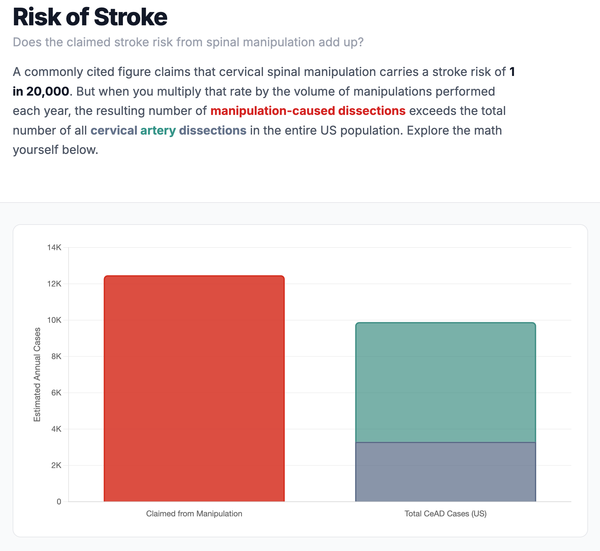

# Risk of Stroke from Spinal Manipulation



An interactive calculator that examines the arithmetic plausibility of the commonly cited "1 in 20,000" stroke risk figure for cervical spinal manipulation.

The tool multiplies the claimed per-manipulation risk by the estimated annual volume of cervical manipulations performed in the US, then compares the resulting number of supposed manipulation-caused dissections against the total number of cervical artery dissections (CeAD) observed across the entire US population from all causes. When the math is run, the claimed figure implies more manipulation-caused dissections than actually exist — making the cited risk rate epidemiologically implausible.

All assumptions are adjustable via interactive sliders so users can explore different scenarios.

## Stack

- [SvelteKit](https://kit.svelte.dev/) + TypeScript
- [Tailwind CSS v4](https://tailwindcss.com/)
- [Chart.js](https://www.chartjs.org/) for the bar chart visualization
- Static site output via `@sveltejs/adapter-static`

## Developing

Install dependencies and start the dev server:

```sh
npm install
npm run dev

# or open in a new browser tab automatically
npm run dev -- --open
```

## Building

```sh
npm run build
npm run preview  # preview the production build locally
```

## Type Checking

```sh
npm run check
```
